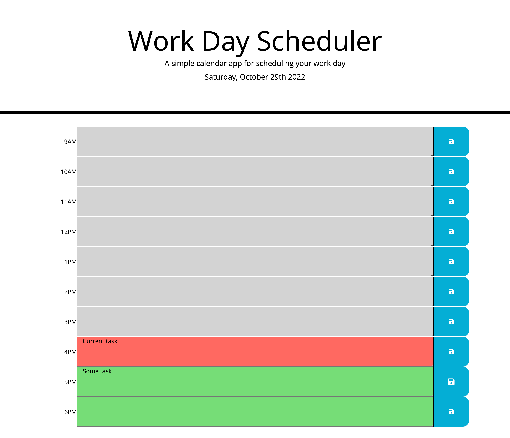

# Work day scheduler web app. Homework #5

Work day scheduler is a web application which was created as part of Homework #5.  
The application was created to help plan tasks during the working day.

## Usage

The project was deployed using Github hosting and is available  
at the link https://kas500.github.io/work-day-scheduler/.

The main page of the application displays a table of working hours.  
The first column displays the hours.  
The second column is for describing work tasks.  
The third column contains a button for saving tasks to local storage.  

## Picture #1
